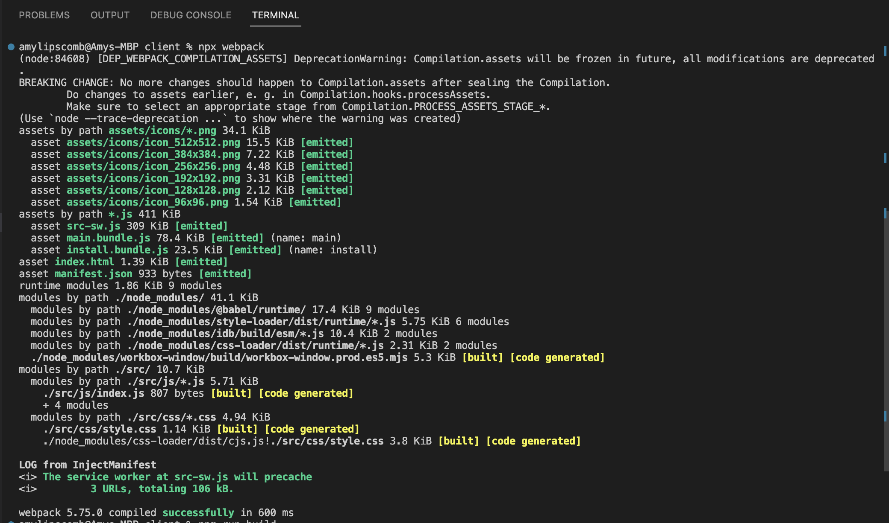
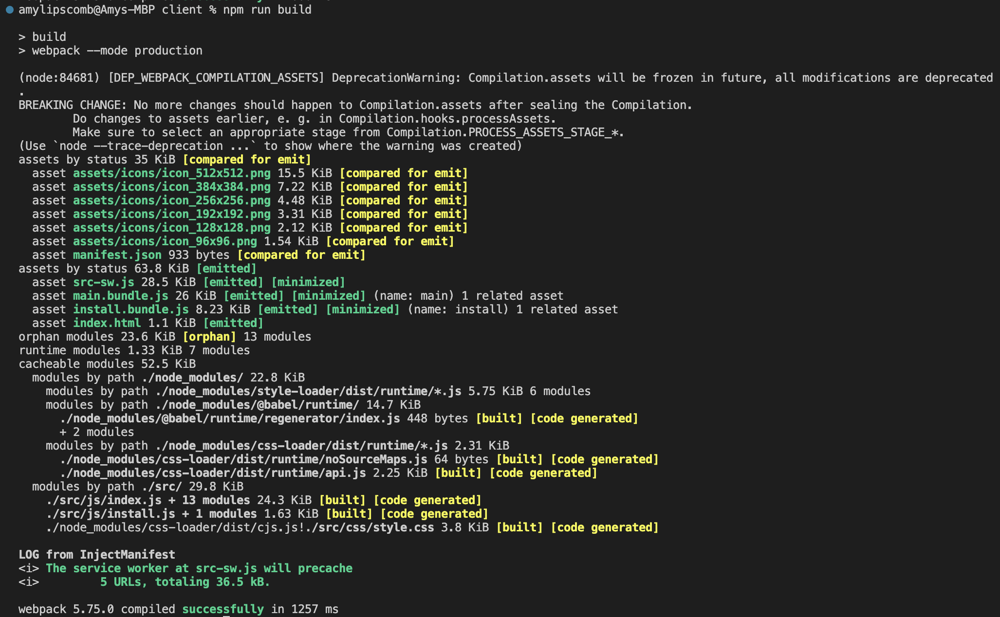
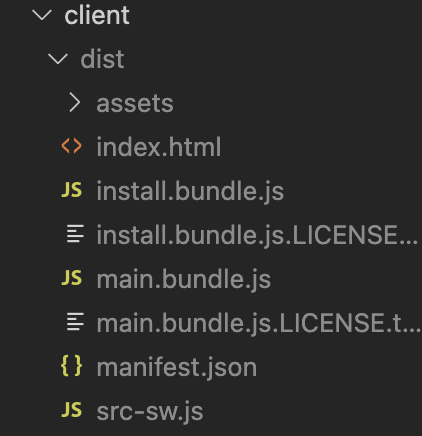

# text-editor-pwa


## Description

Webpack is an open-source module bundler for Javascript, and was used to create a text editor that can be found at this [Heroku Deployed Site](https://hidden-harbor-78416.herokuapp.com/). Enjoy!


----
## Table of Contents 

  * [Installation](#installation)
  * [Usage](#usage)
  * [License](#license)
  * [Contribution](#contribution)
  * [Tests](#tests)
  * [Technologies](#technologies)
  * [Questions](#questions)

---
## Installation

After setting up my repo, the first action item I tackled was creating the file structure. Once that was complete, I moved on to installing the npm package- [idb](https://www.npmjs.com/package/idb). To install the package, I typed the following into the command line:
```
 npm i idb
 ```

Then to start the server, I typed the following command:
```
npm start
```

And to run and build the webpack, I typed the following commands:

```
npx webpack; npm run build
```


---

## Usage

Below is what appears in the terminal, when the code works properly. 





After I did that, the "dist" folder was created within the "client". Within the "dist" folder, several files were created as well, including an index.html, install.bundle.js, main.bundle.js, manifest.json, and a src-sw.js.  





---

## Contribution

  None.

  ---

## License

```
This project is licensed under MIT.
```

---


## Tests

None.

 ---

 ## Technologies

* JavaScript
* Node.js
    * npm packages:
       * [idb](https://www.npmjs.com/package/idb)  
* Heroku
* VS Code

 ---

## Questions

If you'd like to see more of my projects, check out my github: [amylipscomb](https://github.com/amylipscomb).
For further information please contact me at [amy.a.lipscomb@gmail.com](mailto:amy.a.lipscomb@gmail.com)!